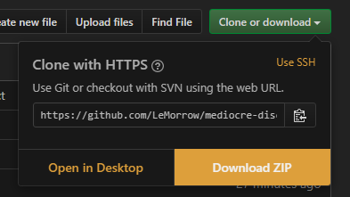
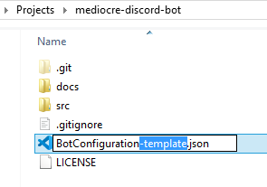
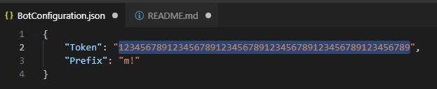
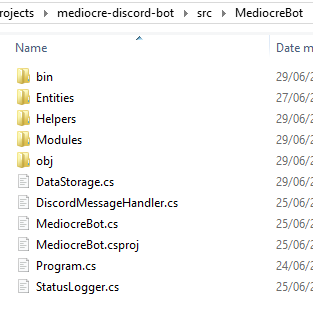
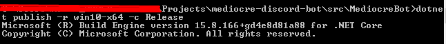

# MediocreBot
|     | About                                                            |
| --- | :--------------------------------------------------------------: |
|  | Are you tired of interesting facts? MediocreBot to the rescue! |

## About

MediocreBot has more than 20 barely interesting facts about your discord server. 
Examples include:
* Who has the oldest discord account in the server?
* What is the average length for a message in this channel?
* When was this server created?
* Who wrote the 1337th message in this channel?

## Usage
You can invoke a command by starting your message with a mention of the bot or the prefix. 
Examples: `@MediocreBot command` or `m!command` (if the prefix is left to the default `m!`).

## Commands
There are currently two commands that you can invoke.

### `info`
__Description__: A short introduction of the bot. How it's used, why it's made and by who. This is essentially the README you are currently reading.

__Example usage__: `@MediocreBot info`

### `fact <channel>`
__Description__: A random fact about the channel. This command will perform a one-time scan for the channel when it's invoked for the first time. This may take a few minutes, since the bot can read about 300-700 messages per second. This means if the channel has 10 000 messages, the setup will take about 20 seconds. This only has to be done once (per channel and session).

__Parameters__: The *channel* parameter is optional and defaults to the channel that the command is invoked from. The channel parameter allows you to specify another channel to give a random fact about. This can be useful if you have a channel dedicated for bot usage but want statistics on the main channel without spamming it.

__Example usage__: `@MediocreBot fact` *or with optional parameter* `@MediocreBot fact #main`

## Setup
This should not take longer than a few minutes.

### 1. Download the files from this repository

### 2. Rename `BotConfiguration-template.json` to `BotConfiguration.json`

### 3. Open `BotConfiguration.json` with a text editor and insert your token.
*If you don't know how to get a token, read [this tutorial](https://www.writebots.com/discord-bot-token/).*

### 4. Open a command window and navigate to `/src/MediocreBot/`. This folder should have `MediocreBot.csproj` in it.
:bulb: *You don't have the `bin` or `obj` folders yet. This is not a problem.*

### 5. Run the command `dotnet publish -r win10-x64 -c Release`
:warning: *If you are not running windows, use the [correct runtime identifier for your system](https://docs.microsoft.com/en-us/dotnet/core/rid-catalog).*

This requires dotnet to be installed. You can verify that you have all the requirements by running the command `dotnet --version`. If it gives you a non-error output, you're probably good to go :smile:

### 6. Run `MediocreBot.exe` in `/src/MediocreBot/bin/Release/netcoreapp2.1/win10-x64/`
And that's it! If your bot doesn't go online, you can either open an issue or write to me on Discord: `LeMorrow#8192`.

## Why?
This bot was made in 4 days for [Discord Hack Week 2019](https://dis.gd/hackweek). It is a submission for the `shitpost` category. 

